# Quick elimination of SQL Injection using CxAudit UI
* Author:   Pedric Kng  
* Updated:  06 Jan 2021

This exercise [AccountDao.cs](SQLi/AccountDao.cs) illustrates 4 scenarios using CxAudit quick add functionality;
1. Parameters not sanitized leading to a SQL injection
2. Parameters are sanitized using prepared statements
3. Sanitization method not recognized not CxSAST; add to sanitizers
4. Interactive input not detected; add to interactive inputs

***

*Step1: Open CxAudit > New Local Project > [Select folder containing AccountDao.cs]*

*Step2: Query > CSharp > Cx > CSharp_High_Risk > SQL_Injection*

*Step3: Review the results*

- True Postive: Parameters are not been sanitized and feeded into a SQL statement
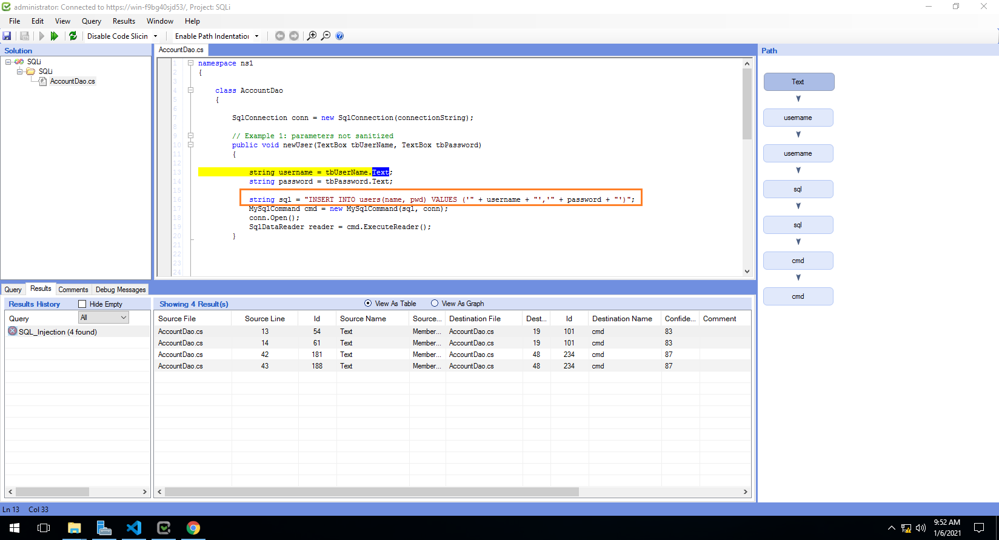

- No results because parameters are been sanitized using prepared statements
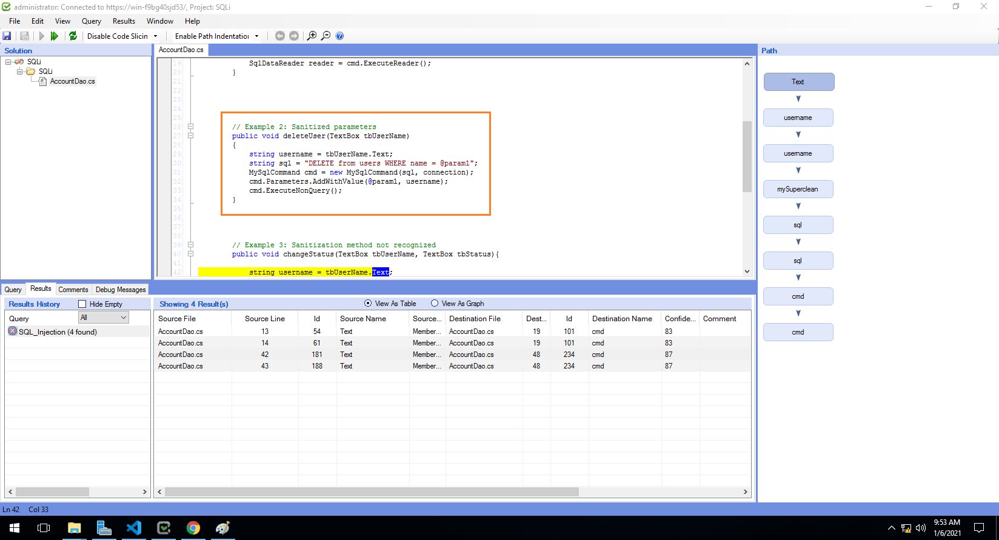

- False Postive: Proprietary sanitizers 'mySuperclean' are not been recognized by CxSAST
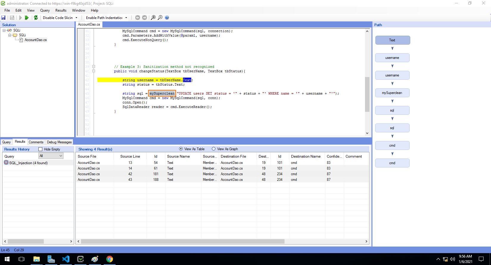

- False Negative: Parameter are not been recognized by CxSAST
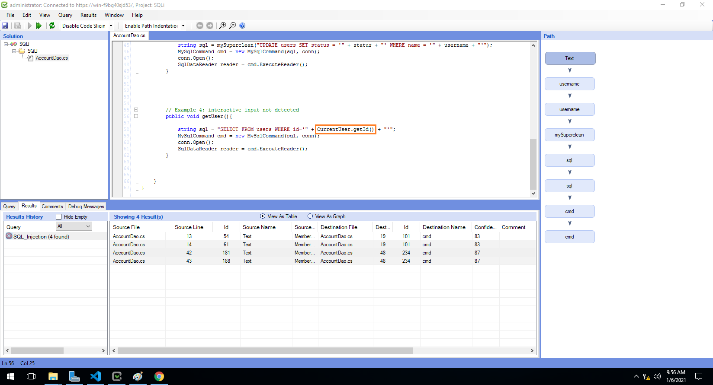

*Step4: Adding the proprietary sanitizer to address false-positive*
    
1. View SQL Injection query
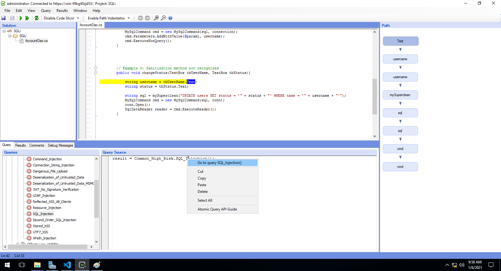

2. Atomic query 'Find_SQL_Sanitize'
    

3. Add the proprietary sanitizer 'mySuperclean' to 'Find_SQL_Sanitize'.
    
4. Extended query
    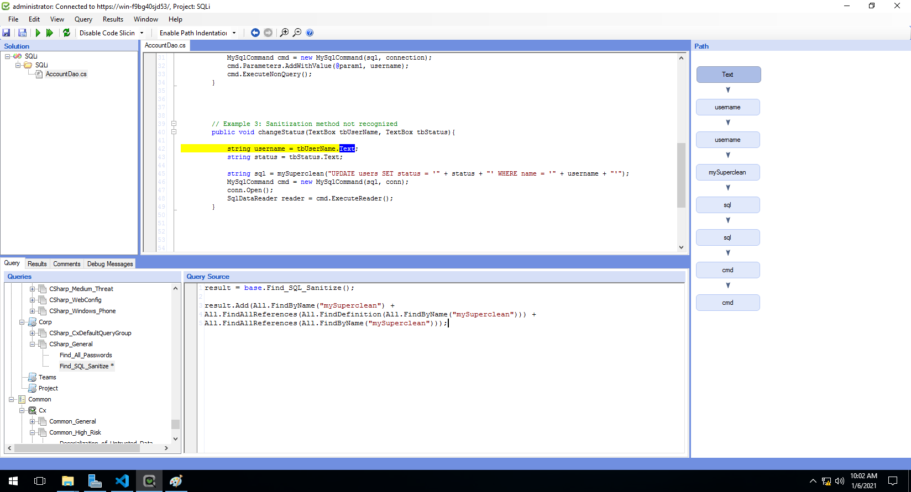

5. Execute SQL_Injection query to see false-positive result been removed
    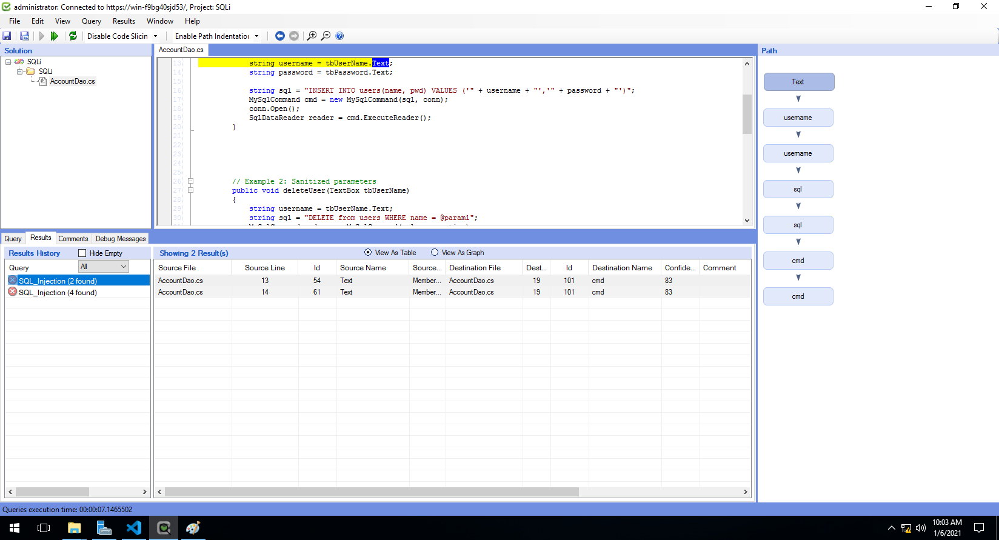

*Step5: Adding the non-recognized input to address false-negative*
1. View Atomic query 'Find_Interactive_Inputs'
    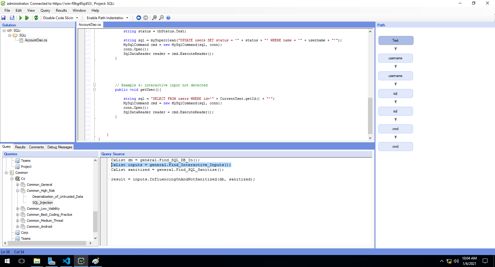
2. Add the inputs to 'Find_Interactive_Inputs'.
    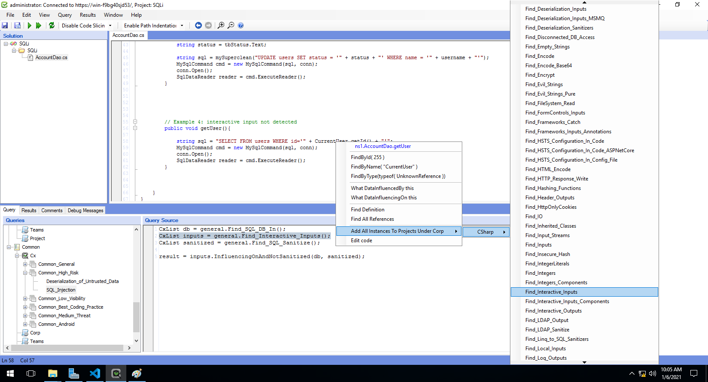

3. Extended query
    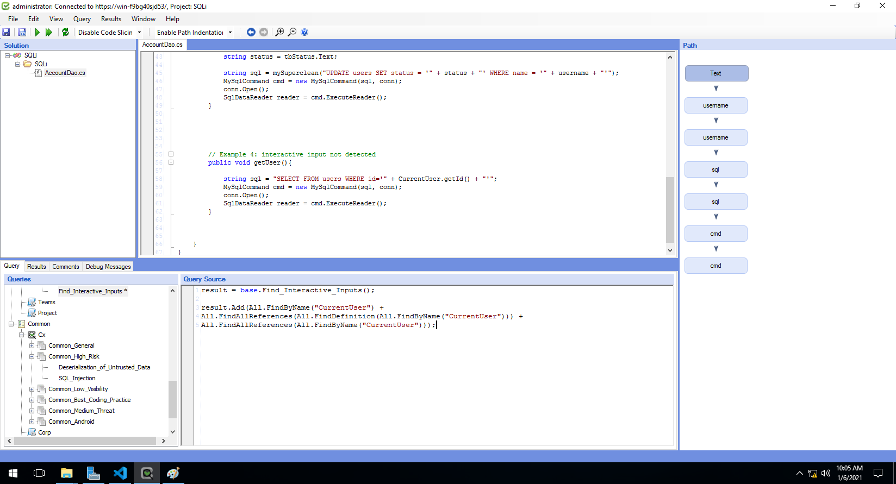
4. Execute SQL_Injection query to see false-negative result been added
    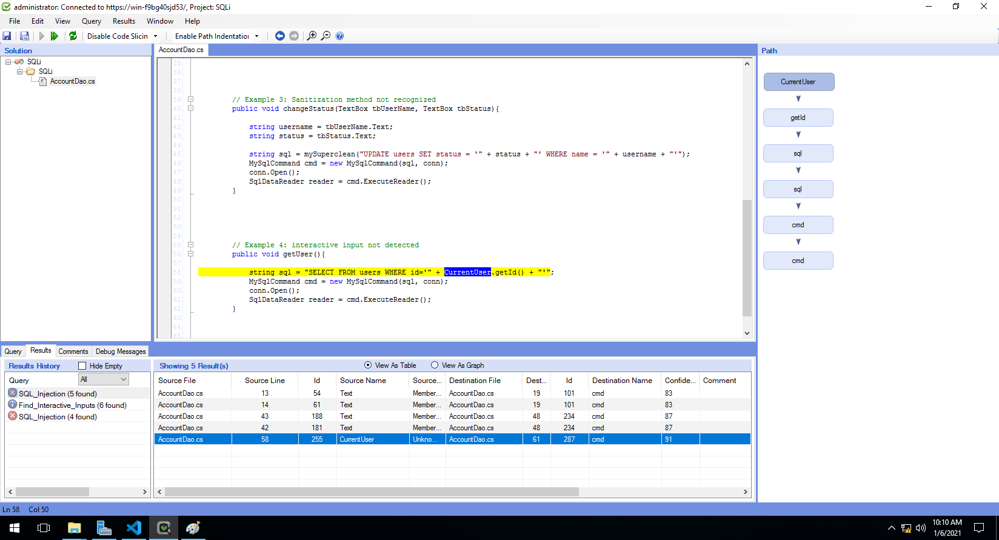
  
